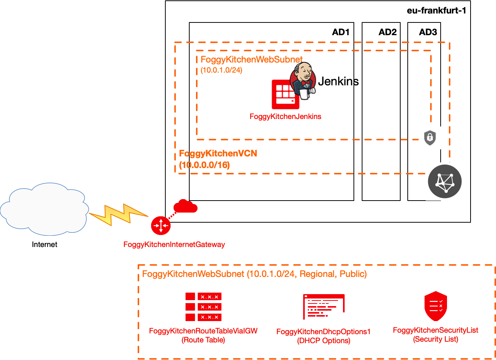

# Terraform OCI Jenkins

## Project description

In this repository I have documented my hands-on experience with Terrafrom for the purpose of Jenkins setup. This set of HCL based Terraform files can customized according to any requirements.  

## Topology Diagram 

With the usage of this example HCL code you can build topology documented by diagram below. This topology is extremly simplified for education purposes and rather cannot be used for production implementations. 



## How to use code 

### STEP 1.

Clone the repo from github by executing the command as follows and then go to terraform-oci-jenkins directory:

```
[opc@terraform-server ~]$ git clone https://github.com/mlinxfeld/terraform-oci-jenkins.git
Cloning into 'terraform-oci-jenkins'...
remote: Enumerating objects: 45, done.
remote: Counting objects: 100% (45/45), done.
remote: Compressing objects: 100% (31/31), done.
remote: Total 45 (delta 19), reused 40 (delta 14), pack-reused 0
Unpacking objects: 100% (45/45), done.

[opc@terraform-server ~]$ cd terraform-oci-jenkins/

[opc@terraform-server terraform-oci-jenkins]$ ls -latr
total 424
-rw-r--r--   1 opc opc     514  4 wrz 12:29 vcn.tf
-rw-r--r--   1 opc opc     501  4 wrz 12:29 subnet1.tf
-rw-r--r--   1 opc opc     715  4 wrz 12:29 security_list.tf
-rw-r--r--   1 opc opc     431  4 wrz 12:29 route.tf
-rw-r--r--   1 opc opc     229  4 wrz 12:29 provider.tf
-rw-r--r--   1 opc opc     250  4 wrz 12:29 internet_gateway.tf
-rw-r--r--   1 opc opc     442  4 wrz 12:29 dhcp_options.tf
-rw-r--r--   1 opc opc     185  4 wrz 12:29 compartment.tf
drwxr-xr-x  56 opc opc    1792  4 wrz 13:26 ..
-rwxr-xr-x   1 opc opc    1130  7 wrz 10:23 compute.tf
-rw-r--r--   1 opc opc     725  7 wrz 11:57 variables.tf
drwxr-xr-x   4 opc opc     128  7 wrz 12:27 scripts
-rw-r--r--   1 opc opc    3394  7 wrz 12:27 remote.tf
-rw-r--r--   1 opc opc     145  7 wrz 12:27 output.tf
drwxr-xr-x  12 opc opc     384  7 wrz 12:32 .git
-rw-r--r--@  1 opc opc    8191  7 wrz 12:32 README.md
-rw-r--r--@  1 opc opc  155757  7 wrz 12:37 terraform-oci-jenkins.png
drwxr-xr-x  18 opc opc     576  7 wrz 12:37 .

```

### STEP 2.

Within web browser go to URL: https://www.terraform.io/downloads.html. Find your platform and download the latest version of your terraform runtime. Add directory of terraform binary into PATH and check terraform version:

```
[opc@terraform-server terraform-oci-jenkins]$ export PATH=$PATH:/home/opc/terraform

[opc@terraform-server terraform-oci-jenkins]$ terraform --version

Your version of Terraform is out of date! The latest version
is 0.13.2. You can update by downloading from https://www.terraform.io/downloads.html

Terraform v0.13.0
```

### STEP 3. 
Next create environment file with TF_VARs:

```
[opc@terraform-server terraform-oci-jenkins]$ vi setup_oci_tf_vars.sh
export TF_VAR_user_ocid="ocid1.user.oc1..aaaaaaaaob4qbf2(...)uunizjie4his4vgh3jx5jxa"
export TF_VAR_tenancy_ocid="ocid1.tenancy.oc1..aaaaaaaas(...)krj2s3gdbz7d2heqzzxn7pe64ksbia"
export TF_VAR_compartment_ocid="ocid1.tenancy.oc1..aaaaaaaasbktyckn(...)ldkrj2s3gdbz7d2heqzzxn7pe64ksbia"
export TF_VAR_fingerprint="00:f9:d1:41:bb:57(...)82:47:e6:00"
export TF_VAR_private_key_path="/tmp/oci_api_key.pem"
export TF_VAR_region="eu-frankfurt-1"
export TF_VAR_private_key_oci="/tmp/id_rsa"
export TF_VAR_public_key_oci="/tmp/id_rsa.pub"

[opc@terraform-server terraform-oci-jenkins]$ source setup_oci_tf_vars.sh
```

### STEP 4.
Run *terraform init* with upgrade option just to download the lastest neccesary providers:

```
[opc@terraform-server terraform-oci-jenkins]$ terraform init -upgrade

Initializing the backend...

Initializing provider plugins...
- Finding hashicorp/oci versions matching ">= 3.65.0"...
- Finding latest version of hashicorp/null...
- Installing hashicorp/null v2.1.2...
- Installed hashicorp/null v2.1.2 (signed by HashiCorp)
- Installing hashicorp/oci v3.91.0...
- Installed hashicorp/oci v3.91.0 (signed by HashiCorp)

The following providers do not have any version constraints in configuration,
so the latest version was installed.

To prevent automatic upgrades to new major versions that may contain breaking
changes, we recommend adding version constraints in a required_providers block
in your configuration, with the constraint strings suggested below.

* hashicorp/null: version = "~> 2.1.2"

Terraform has been successfully initialized!

You may now begin working with Terraform. Try running "terraform plan" to see
any changes that are required for your infrastructure. All Terraform commands
should now work.

If you ever set or change modules or backend configuration for Terraform,
rerun this command to reinitialize your working directory. If you forget, other
commands will detect it and remind you to do so if necessary.
```

### STEP 5.
Run *terraform apply* to provision the content of this code (type **yes** to confirm the the apply phase):

```
[opc@terraform-server terraform-oci-jenkins]$ terraform apply 

data.oci_identity_availability_domains.ADs: Refreshing state...
data.oci_core_images.OSImageLocal: Refreshing state...

An execution plan has been generated and is shown below.
Resource actions are indicated with the following symbols:
  + create
 <= read (data resources)

Terraform will perform the following actions:

  # data.oci_core_images.OSImageLocal will be read during apply
  # (config refers to values not yet known)
 <= data "oci_core_images" "OSImageLocal"  {

(...)

Plan: 10 to add, 0 to change, 0 to destroy.

Do you want to perform these actions?
  Terraform will perform the actions described above.
  Only 'yes' will be accepted to approve.


(...)

null_resource.FoggyKitchenJenkisDisableSetupWizard (remote-exec): ****************************
null_resource.FoggyKitchenJenkisDisableSetupWizard (remote-exec): Jenkins admin user password:
null_resource.FoggyKitchenJenkisDisableSetupWizard (remote-exec): ****************************
null_resource.FoggyKitchenJenkisDisableSetupWizard (remote-exec): 7019be3396a1406bb1a22470196863f8
null_resource.FoggyKitchenJenkisDisableSetupWizard (remote-exec): ****************************
null_resource.FoggyKitchenJenkisDisableSetupWizard: Still creating... [10s elapsed]
null_resource.FoggyKitchenJenkisDisableSetupWizard: Creation complete after 10s [id=1075918741008349107]

Apply complete! Resources: 10 added, 0 changed, 0 destroyed.

Outputs:

FoggyKitchenJenkinsURL = [
  "http://150.136.39.73:8080",
]

(...)

```

### STEP 6.
Login to Jenkins via web browser with the URL under outputs and admin user password in remote exec output above.


### STEP 7.
After testing the environment you can remove the whole OCI infra. You should just run *terraform destroy* (type **yes** for confirmation of the destroy phase):

```
[opc@terraform-server terraform-oci-private-atp]$ terraform destroy

data.oci_identity_availability_domains.ADs: Refreshing state...
data.oci_core_images.OSImageLocal: Refreshing state...

(...)

Plan: 0 to add, 0 to change, 10 to destroy.

Do you really want to destroy all resources?
  Terraform will destroy all your managed infrastructure, as shown above.
  There is no undo. Only 'yes' will be accepted to confirm.

  Enter a value: yes

(...)

oci_identity_compartment.FoggyKitchenCompartment: Destroying... [id=ocid1.compartment.oc1..aaaaaaaayxvhhjidfxsq35muvshgxv62ac2mn6mi2yo2xqzsq53jgkuozfwq]
oci_identity_compartment.FoggyKitchenCompartment: Destruction complete after 0s

Destroy complete! Resources: 10 destroyed.
```
